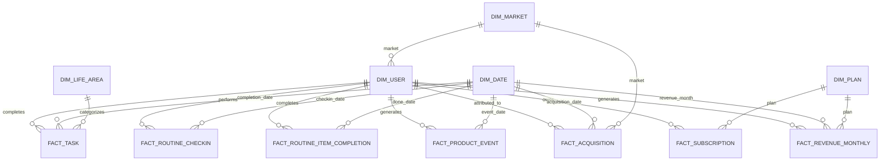

# PROTANNI — Analytical Data Model

**Stage:** Phase 1 — Data Foundation  
**Source basis:** Live PROTANNI Supabase schema metadata + KPI Framework + Data Dictionary  
**Model purpose:** Support acquisition, activation, engagement, conversion, revenue, retention, market and cohort analysis without exposing production user data  
**Public-data rule:** The public portfolio uses synthetic/modelled data only

## 1. Design Objective

The analytical model translates PROTANNI's operational data into a structure that can answer Business Operations questions consistently.

It must support:

- acquisition and signup analysis;
- onboarding and activation;
- task/routine core-value behavior;
- weekly engagement and WCVU;
- trial and paid conversion;
- MRR / New MRR / ARPU once a monetary source exists;
- D7 / D30 retention;
- paid retention and churn;
- market/language segmentation;
- cohort analysis;
- later Power BI modeling and WBR/QBR reporting.

The model is intentionally separate from the production application schema. Production tables remain optimized for the product. The analytical layer organizes the same business entities around reporting grains, joins, and metrics.

## 2. Architecture

```text
Production / Operational Sources
        │
        ├── Supabase Auth
        ├── Supabase public schema
        ├── Future web/product analytics
        └── Future normalized revenue source
        │
        ▼
Source-Compatible Analytical Layer
        │
        ├── users
        ├── profiles
        ├── tasks
        ├── routines
        ├── routine_checkins
        ├── routine_item_checkins
        ├── billing_plans
        ├── billing_subscriptions
        ├── acquisition_touches        [future/modelled]
        ├── product_events             [future/modelled]
        └── subscription_revenue       [future/modelled]
        │
        ▼
Dimensional / Business Layer
        │
        ├── dim_user
        ├── dim_date
        ├── dim_life_area
        ├── dim_plan
        ├── dim_market
        ├── fact_task
        ├── fact_routine_checkin
        ├── fact_product_event
        ├── fact_acquisition
        ├── fact_subscription
        └── fact_revenue_monthly
        │
        ▼
Decision Marts
        │
        ├── mart_user_day
        ├── mart_user_week
        ├── mart_activation_funnel
        ├── mart_retention_cohort
        ├── mart_subscription_month
        └── mart_wbr
```

## 3. Modeling Principles

### 3.1 Preserve source nomenclature

The source-compatible layer keeps production names wherever practical.

Examples:
- `tasks`
- `routines`
- `routine_checkins`
- `billing_subscriptions`

This creates traceability between Supabase, SQL, the synthetic dataset, and BI.

### 3.2 Separate source facts from business interpretation

Example:

`tasks.completed_at` is a source field.

`is_core_value_action` is an analytical business rule derived from multiple conditions.

These should not be treated as the same thing.

### 3.3 Declare missing sources explicitly

Synthetic data may represent future sources needed to test the analytical model, but those fields must be labeled as **modelled / not currently available in production**.

### 3.4 Define one clear grain per fact

Every fact table must answer:

> What does one row represent?

This prevents double counting.

### 3.5 Build for cohort and time analysis

Nearly every key KPI depends on time. All facts therefore connect to a canonical date dimension or expose a clear event date/timestamp.

## 4. Source-Compatible Portfolio Tables

These are the tables the public synthetic dataset should mirror or emulate.

| Table | Grain | Production basis | Public synthetic status |
|---|---|---|---|
| `users` | One row per user | `auth.users` selected safe fields | Required |
| `profiles` | One row per user profile | `public.profiles` selected safe fields | Required |
| `life_areas` | One row per user life area | `public.life_areas` | Optional / useful |
| `tasks` | One row per task | `public.tasks` selected fields | Required |
| `routines` | One row per routine | `public.routines` selected fields | Required |
| `routine_checkins` | One row per routine/day check-in | `public.routine_checkins` | Required |
| `routine_item_checkins` | One row per routine-item completion | `public.routine_item_checkins` | Required |
| `billing_plans` | One row per plan | `public.billing_plans` selected fields | Required for monetization |
| `billing_subscriptions` | One row per subscription | `public.billing_subscriptions` selected safe fields | Required |
| `acquisition_touches` | One row per acquisition touch/sign-up attribution record | Missing production source | Synthetic/modelled |
| `product_events` | One row per durable user interaction | Missing normalized production source | Synthetic/modelled |
| `subscription_revenue` | One row per subscription billing/revenue period | Missing normalized monetary source | Synthetic/modelled |

Production UUIDs, text content, raw billing payloads, provider secrets, emails, and personal notes must not be copied.

## 5. Dimensional Model

### 5.1 Dimensions

#### `dim_user`

**Grain:** one row per analytical user.

Primary sources:
- `users`
- `profiles`

Core fields:

| Field | Meaning |
|---|---|
| `user_id` | Synthetic stable user key |
| `signup_at` | Account creation timestamp |
| `signup_date` | Date component of signup |
| `locale` | Interface locale |
| `timezone` | User timezone |
| `onboarding_completed` | Current onboarding completion state |
| `ai_personalization_enabled` | AI personalization preference |
| `market_key` | Analytical market mapping; synthetic/future until a reliable market source exists |
| `signup_cohort_month` | Signup cohort used for retention analysis |

Do not include email, full name, avatar URL, or real identifiers in the public dataset.

#### `dim_date`

**Grain:** one row per calendar date.

Core fields:

- `date_key`
- `calendar_date`
- `day_of_week`
- `week_start_date`
- `month_start_date`
- `month_name`
- `quarter`
- `year`
- `is_weekend`

This is a derived analytical dimension rather than a production table.

#### `dim_life_area`

**Grain:** one row per analytical life-area category.

Primary source:
- `life_areas`

Core fields:
- `life_area_id`
- `life_area_slug`
- `life_area_name`

Public data should use canonical/synthetic categories rather than user-specific free text.

#### `dim_plan`

**Grain:** one row per commercial plan.

Primary source:
- `billing_plans`

Core fields:
- `plan_id`
- `plan_key`
- `interval_unit`
- `interval_count`
- `trial_days`
- `active`

A monetary plan value is not currently available as a normalized production field.

#### `dim_market`

**Grain:** one row per analytical market.

Initial portfolio categories may include:
- Brazil
- International / English-speaking

This dimension is required by the business questions but is not yet backed by a reliable production country field.

**Status:** modelled analytical dimension.

Do not infer market from `locale` as if the two were equivalent.

## 6. Fact Tables

### 6.1 `fact_task`

**Grain:** one row per task.

Primary source:
- `tasks`

Core fields:

| Field | Purpose |
|---|---|
| `task_id` | Task key |
| `user_id` | User key |
| `life_area_id` | Optional area relationship |
| `project_id` | Optional project context |
| `parent_task_id` | Subtask hierarchy |
| `created_at` | Task creation |
| `due_date` | Planned due date |
| `completed_at` | Completion timestamp |
| `status` | Task lifecycle |
| `priority` | Task priority |
| `is_today` | Current Today flag |
| `today_added_at` | Today-entry timestamp |
| `is_deleted` | Soft-delete exclusion |

Derived analytical fields may include:
- `is_completed`
- `completion_date`
- `days_to_complete`
- `is_core_value_candidate`

**Important:** historical `action_source = Today` cannot be proven reliably for every task completion with the current schema. The model must not manufacture this fact.

### 6.2 `fact_routine_checkin`

**Grain:** one row per routine check-in per user/date.

Primary sources:
- `routines`
- `routine_checkins`

Core fields:
- `routine_checkin_id`
- `routine_id`
- `user_id`
- `checkin_date`
- `created_at`
- routine attributes needed for segmentation

Derived:
- `is_active_routine`
- `routine_age_days`

A related item-level table or bridge can be built from `routine_item_checkins`.

### 6.3 `fact_routine_item_completion`

**Grain:** one row per routine item check-in.

Primary source:
- `routine_item_checkins`

Core fields:
- `routine_item_checkin_id`
- `routine_checkin_id`
- `routine_item_id`
- `user_id`
- `is_done`
- `done_at`

This provides the most precise current routine completion timestamp.

### 6.4 `fact_product_event`

**Grain:** one durable product interaction event.

Proposed fields:

```text
event_id
user_id
event_name
occurred_at
event_date
surface
object_type
object_id
properties
```

Example event names:
- `onboarding_completed`
- `today_opened`
- `task_added_to_today`
- `task_completed`
- `routine_completed`
- `daily_focus_viewed`
- `daily_reflection_viewed`
- `weekly_insight_viewed`
- `paywall_viewed`

**Status:** future instrumentation / synthetic in the portfolio dataset.

This fact is the preferred long-term source for WAU, AI adoption, funnel sequencing, and the North Star's Today-path requirement.

### 6.5 `fact_acquisition`

**Grain:** one acquisition attribution record associated with a visitor or signed-up user.

Proposed fields:
- `acquisition_id`
- `user_id`
- `occurred_at`
- `channel`
- `source`
- `medium`
- `campaign`
- `landing_page`
- `market_key`
- `is_qualified_visit`
- `converted_to_signup`

**Status:** future external source / synthetic in portfolio.

Needed for Visitor → Sign-up Conversion and channel analysis.

### 6.6 `fact_subscription`

**Grain:** one subscription record.

Primary source:
- `billing_subscriptions`

Core fields:
- `subscription_id`
- `user_id`
- `plan_id`
- `provider`
- `lifecycle_state`
- `starts_at`
- `trial_starts_at`
- `trial_ends_at`
- `current_period_starts_at`
- `current_period_ends_at`
- `canceled_at`
- `auto_renews`

Exclude:
- provider subscription IDs;
- purchase tokens;
- raw provider payloads.

### 6.7 `fact_revenue_monthly`

**Grain:** one subscription × month revenue record.

Proposed fields:
- `subscription_id`
- `user_id`
- `plan_id`
- `month_start_date`
- `currency`
- `gross_recurring_amount`
- `normalized_mrr`
- `is_new_mrr`
- `is_active_paid`

**Status:** modelled/future source because the current normalized production schema does not contain the required monetary amount.

This fact enables:
- MRR;
- New MRR;
- ARPU;
- revenue by plan;
- revenue by market;
- actual-vs-plan modeling later.

## 7. Core Relationships



## 8. Derived Decision Marts

### 8.1 `mart_user_day`

**Grain:** one user × calendar day.

Purpose:
- daily activity flag;
- core-value day logic;
- product activity intensity;
- later retention and WCVU calculation.

Potential fields:
- `user_id`
- `calendar_date`
- `task_completions`
- `routine_completions`
- `core_value_actions`
- `is_active_day`
- `is_core_value_day`
- `ai_interactions`
- `trial_active`
- `paid_active`

### 8.2 `mart_user_week`

**Grain:** one user × reporting week.

Purpose:
- WCVU;
- Core Value Days;
- WAU;
- Routine Adoption;
- weekly cohort analysis.

Potential fields:
- `user_id`
- `week_start_date`
- `active_days`
- `core_value_days`
- `is_wau`
- `is_wcvu`
- `used_routine`
- `used_ai`

**Important:** `is_wcvu` should only use the exact “through Today” definition once that event/source is durable. Until then, a provisional field should be clearly named, for example `is_core_value_user_candidate`.

### 8.3 `mart_activation_funnel`

**Grain:** one signed-up user.

Purpose:
- signup → onboarding → object creation → first value → trial → paid.

Potential fields:
- `user_id`
- `signup_at`
- `onboarding_completed`
- `first_task_created_at`
- `first_routine_created_at`
- `first_core_value_at`
- `activated_at`
- `time_to_first_value_hours`
- `trial_started_at`
- `paid_started_at`

Missing event timing must remain null or modelled; it should not be inferred from unrelated timestamps.

### 8.4 `mart_retention_cohort`

**Grain:** one cohort × retention window.

Purpose:
- D7;
- D30;
- later weekly/monthly retention curves.

Potential fields:
- `cohort_date`
- `cohort_type`
- `cohort_size`
- `retention_window`
- `retained_users`
- `retention_rate`

### 8.5 `mart_subscription_month`

**Grain:** one month × plan × market.

Purpose:
- active subscribers;
- trial starts;
- trial → paid;
- MRR;
- New MRR;
- ARPU;
- churn.

### 8.6 `mart_wbr`

**Grain:** one reporting week × KPI.

Purpose:
- Weekly Business Review.

Proposed fields:
- `week_start_date`
- `metric_name`
- `metric_value`
- `baseline_or_target`
- `status`
- `variance`
- `commentary`
- `owner`
- `action`
- `due_date`

This mart can later feed the automated WBR workflow.

## 9. KPI Coverage

| KPI | Analytical object |
|---|---|
| New Sign-ups | `dim_user.signup_at` |
| Visitor → Sign-up | `fact_acquisition` |
| Onboarding Completion | `dim_user` / `fact_product_event` later |
| Activation | `mart_activation_funnel` |
| Time to First Value | `mart_activation_funnel` |
| WCVU | `mart_user_week` + durable Today event requirement |
| Core Value Days | `mart_user_day` → `mart_user_week` |
| WAU | `mart_user_week` |
| Routine Adoption | routine facts + `mart_user_week` |
| AI Feature Adoption | `fact_product_event` |
| Trial Start Rate | `fact_subscription` + eligibility rule |
| Trial → Paid | `fact_subscription` |
| MRR | `fact_revenue_monthly` |
| New MRR | `fact_revenue_monthly` |
| ARPU | `fact_revenue_monthly` |
| D7 Retention | `mart_retention_cohort` |
| D30 Retention | `mart_retention_cohort` |
| Paid Retention | `fact_subscription` / `mart_subscription_month` |
| Subscriber Churn | `fact_subscription` / `mart_subscription_month` |

## 10. Phase 1 SQL Question Coverage

The model must support the planned SQL pack, including questions such as:

1. How many users signed up by week?
2. Which market produces more sign-ups?
3. What share of users complete onboarding?
4. How many users create a Task or Routine?
5. How long does first value take?
6. How many users complete tasks each week?
7. How many users complete routines each week?
8. How many distinct core-value days does each user have?
9. What is the provisional WCVU trend?
10. How does routine adoption differ by cohort?
11. Which signup cohorts retain better at D7?
12. Which signup cohorts retain better at D30?
13. Does activation correlate with retention?
14. Does routine adoption correlate with retention?
15. Does AI interaction correlate with retention?
16. What share of eligible users start a trial?
17. What share of completed trials become paid?
18. How many paid subscribers are active?
19. What is MRR by month?
20. What is New MRR by month?
21. What is ARPU by month?
22. What is monthly subscriber churn?
23. What is paid retention by cohort?
24. Which plan contributes most recurring revenue?
25. How do Brazil and international cohorts differ?
26. Which acquisition channels generate higher activation?
27. Which acquisition channels generate higher paid conversion?
28. Which acquisition channels produce better D30 retention?
29. What proportion of WAU becomes WCVU?
30. Where are the largest funnel drop-offs?

## 11. B2C Core vs Future B2B / B2B2C Extension

The current analytical model is designed around PROTANNI's **initial B2C subscription motion**.

During Phase 3, a future B2B/B2B2C expansion model may add:

- `accounts`
- `contacts`
- `opportunities`
- `pipeline_events`
- `contracts`
- `seats`
- `account_subscription`
- `account_adoption`

Those objects should not be inserted into the current production-data model as if they already exist.

The Phase 3 RevOps architecture will treat B2B/B2B2C as a **future expansion hypothesis**, while B2C remains the current core business model.

## 12. Public Synthetic Dataset Contract

The next task will create a dataset that:

- uses synthetic stable IDs;
- preserves realistic PK/FK relationships;
- mirrors the source-compatible table names above;
- contains enough time depth for cohort and retention analysis;
- includes deliberately modelled acquisition, event, market, and revenue data to exercise missing future sources;
- contains no production rows;
- clearly marks all modelled fields/sources;
- produces internally consistent funnel and subscription timelines.

## 13. Definition of Done

The analytical model is complete when:

- every Phase 1 executive KPI maps to a fact, dimension, or explicit missing source;
- each fact has a single documented grain;
- production-backed and modelled/future sources are visibly separated;
- the model supports the planned 20–30 SQL business questions;
- the public synthetic dataset can be generated from the specification;
- the model is compatible with later Power BI work;
- no production-sensitive field is required for the public portfolio;
- B2B/B2B2C future architecture is acknowledged without misrepresenting the current product.

The next task is **Create synthetic/anonymized dataset**.
